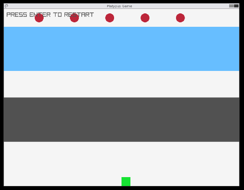
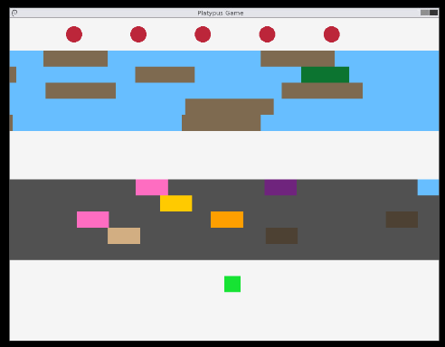

# Platypusser

Jogo estilo Frogger desenvolvido em C com a biblioteca raylib, como trabalho final da disciplina SSC0600 - Introdução à Ciência da Computação I (ICMC-USP, 2026/1).

## Descrição

O jogador controla Perry, o ornitorrinco, que precisa atravessar uma rua movimentada e um rio para chegar ao outro lado. Na rua, é preciso desviar dos carros. No rio, o jogador deve pular de tronco em tronco - cair na água ou ser pego por um jacaré encerra a partida. Chegar ao topo é a vitória; acertar um chapéu no caminho garante um **BONUS WIN!**

O jogo registra o **top 5 de melhores tempos** (menor tempo = melhor) com nome de 3 letras no estilo arcade, além de um contador persistente de vitórias e derrotas.

A movimentação é feita em pequenos saltos, imitando o Frogger original, usando uma variável `hopTimer` para permitir movimentação em intervalos de tempo. Os carros usam texturas selecionadas aleatoriamente de um set encontrado do itch.io, mas inicialmente foram implementados como retângulos preenchidos por cores aleatórias (ver versão do OneCompiler abaixo) usando a mesma lógica sorteio de índice dos vetores. Similarmente, os troncos tem comprimento aleatório entre valores mínimo e máximo.

Uma característica interessante específica do Frogger é que a **verificação de colisão** é negativa na rua e positiva no rio. Ou seja, na rua, se **houver** colisão com um carro, o jogador perde; no rio, se **não houver** colisão com um tronco, o jogador perde.

## Controles
**Durante o jogo:**

| Tecla | Ação |
|---|---|
| `↑ ↓ ← →` | Mover o personagem |
| `Enter` | Iniciar / reiniciar o jogo |

**Entrada de nome após vitória:**

| Tecla | Ação |
|---|---|
| `↑ ↓` | Mudar a letra atual |
| `→` / `Enter` | Confirmar letra / avançar |
| `←` | Voltar uma letra |

## Conceitos implementados

- **Estruturas de controle:** `if/else`, `for`, `while`, `switch`
  - `if/else` — detecção de colisões, verificação de limites da tela e do rio, lógica de vitória/derrota
  - `for` — laço principal de atualização e desenho dos NPCs, inicialização de faixas e chapéus, inserção ordenada no placar
  - `while` — laço principal do jogo (`while (!WindowShouldClose())` em `main.c`) e leitura do arquivo de pontuações
  - `switch` — em `spawnNpc`, determina os atributos de cada tipo de NPC (carro, jacaré, tronco) a partir de um `char` identificador
- **Typedefs e structs:** `character`, `NpcData`, `lane`, `Score`, `Stats`
  - `character` — representa qualquer entidade móvel do jogo (jogador, carros, jacarés, troncos, chapéus). Armazena posição, velocidade, dimensões, cor (para a implementação sem texturas) e índice de textura.
  - `lane` — representa uma faixa da rua ou do rio, com velocidade e posição vertical.
  - `Score` e `Stats` — usadas para persistência: `Score` guarda nome (3 letras), tempo e data de uma entrada do placar; `Stats` guarda o total de vitórias e derrotas.
  - `NpcData` — agrupa os ponteiros para os vetores de carros, jacarés e troncos, seus contadores, e os vetores de texturas correspondentes. Essa decisão foi tomada por quatro razões: evitar assinaturas de função excessivamente longas; permitir que funções como `spawnNpc` e `updateNpcPosition` sejam **agnósticas ao tipo de NPC** — uma única função serve para os três tipos, usando um `char` para distingui-los via `switch`; refletir no código que carros, jacarés e troncos são conceitualmente a mesma coisa (NPCs); e facilitar a adição de novos tipos de NPC no futuro (exemplo: tartarugas, como no Frogger original) sem alterar nenhuma assinatura.
- **Alocação dinâmica:** `malloc`, `realloc`, `free` — vetores de carros, jacarés e troncos crescem e encolhem em tempo real
- **Vetores e strings:** vetor de texturas, vetor de pontuações, nome do jogador (`char[4]`)
- **Funções:** passagem por valor e por referência (ponteiros), funções estáticas auxiliares
- **Manipulação de arquivos:** `scores.txt` (top 5 tempos) e `stats.txt` (vitórias/derrotas) — lidos na inicialização e escritos a cada fim de partida

## Ambiente de desenvolvimento

- **SO:** Fedora Linux 44 (KDE)
- **Compilador:** GCC 16.1.1
- **Biblioteca:** raylib 5.5-3
- **Editor:** VS Code

## Dependências

Instale o raylib antes de compilar. 

### No Fedora (testado no Fedora 44):

```bash
sudo dnf install raylib-devel
```

### No Ubuntu/Debian (testado no Mint 22.3):

```bash
sudo add-apt-repository ppa:texus/raylib && sudo apt update && sudo apt install libraylib5-dev
```

## Como compilar e executar

```bash
# Compilar
make

# Executar
./platypusser

# Ou usando make
make run

# Limpar o executável
make clean
```

O comando completo de compilação gerado pelo Makefile é:

```bash
gcc -o platypusser src/*.c -Iinclude -lraylib -lm
```

## Estrutura do projeto

```
platypusser/
├── assets/          # Texturas do jogo (PNG)
├── include/         # Cabeçalhos (.h)
│   ├── character.h
│   ├── game.h
│   ├── lane.h
│   ├── river.h
│   ├── scores.h
│   └── street.h
├── src/             # Código-fonte (.c)
│   ├── main.c
│   ├── game.c
│   ├── character.c
│   ├── lane.c
│   └── scores.c
├── Makefile
└── README.md
```

Os arquivos `scores.txt` e `stats.txt` são criados automaticamente na pasta do executável após a primeira partida.

## Demonstração

> 🎥 Vídeo em breve.

## Repositório

https://github.com/lfvperes/platypusser

## Versão online usando o OneCompiler

https://onecompiler.com/raylib/44tcvhzrd

A versão grátis da plataforma OneCompiler não permite imagens, portanto está rodando a versão do commit `7610e5af31f54b10abba881913ab05813ad3ea77`, "adjusting speeds and chances", o último commit antes de adicionar as imagens e texturas. Como a **pontuação** e **entrada/saída de arquivos** foram implementadas após adicionar imagens, essa feature também está faltando na versão que roda no OneCompiler.


